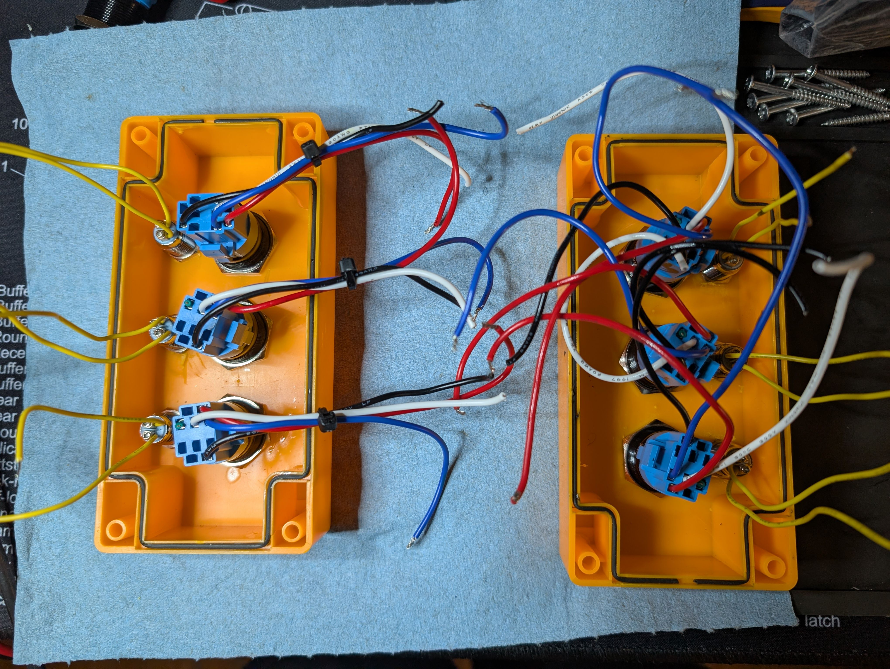

# Busy Light

This repo contains the schematics, PCB files and media for a synced busy-light
control box that can be used to communicate up to 4 states, indicated with LEDs.
The wireless communication is fault-tolerant and utilizes encrypted ESP-NOW for
communication, which means that it doesn't have any other dependencies besides
power and your communications are secure!

## Schematic and PCB

## Components

- [22mm 3x Control box](https://www.aliexpress.us/item/3256805247196863.html)
- [Red, Yellow and Green buttons](https://www.aliexpress.us/item/3256803827064988.html)
- [Button connector leads](https://www.aliexpress.us/item/3256803827064988.html)
- [LED Status Lights](https://www.aliexpress.us/item/2251832784127555.html)
- [Through-hole resistors](https://www.aliexpress.us/item/3256807885719870.html)
- [Wemos D1 Mini ESP 8266](https://www.amazon.com/dp/B081PX9YFV)
- [USB power brick](https://www.amazon.com/dp/B08H5421TJ)
- [Micro-USB cable](https://www.amazon.com/dp/B0D7RZJSPS)

Estimated part costs (without shipping):
- Two 22mm 3x Control boxes: $6.62
- Red, Yellow and Green buttons and connector leads: $20.76
- LED Status Lights: $5.34
- Wemos D1 Mini ESP 8266s: $12.98
- Through-hole resistors: $2.68
- USB power bricks: $11.99
- Micro-USB cables: $5.49

Estimated Total: around $66 for 2 boxes, or around $33 each

## Tools required

- Screwdriver
- Small eyeglasses screwdriver
- Soldering iron
- Solder
- Solid core wires
- Wire stripper
- Arduino IDE
- Kicad

## Assembly notes

- Use blue and white leads for button switches
- Use 150 ohm resistors for all LEDs
- For the Arduino IDE, you will need the
  [ESP8266 library](https://github.com/esp8266/Arduino) installed
- Epoxy putty around the cable is optional but recommended!
- To order the boards from JLCPCB yourself, visit the releases to download the
  compiled gerber files
- The boards are set to 9600 baud serial
- Use serial to determine the board's mac addresses
- Then, fill in `BROADCAST_ADDRESS[]` with both boards' mac addresses
- Toggle the `#if true` between true and false to flash corresponding boxes
- (Optional) Set a new 16 char encryption key for better security

## Repository structure
- `busy-light-1.0.0/` contains the original prototypes I made with protoboards
- `busy-light-1.1.0/` contains the fabbed version of the board
  - There's not enough clearance for the micro-USB cable, so you will have to file
    down the head of the cable or find a lower-profile connection
  - Getting the stranded-core wires through the holes is really annoying, I need
    to make the holes a bit bigger
- `busy-light-1.2.0/` contains a new version that should be easier to solder and
  have better WiFi reception, but hasn't been fabbed yet

## Potential future changes
- Flip the ESP8266 for more clearance for regular micro-USB cables
- Enlarge the holes or find a better connecting solution for the stranded core
  wires
- Add mounting for PCB (Mounting holes?)
- Add mounting for Micro-USB cable
- Use FreeRTOS if I feel like writing a lot of boilerplate

## Project Log

1. The first prototype boards
   
1. Soldering the resistors
   
1. Wrapping wires around pins
   
1. Trimmed wires
   
1. Wired up prototype boards. Do you see the mistake?
   
1. Adding screw terminals
   
1. Fixing my mistake (Please excuse the soldering, most of this project was done
   after midnight 😅😅😅) 
1. Wiring up buttons and lights
   
1. Installing switches into control boxes
   
1. Adding a pull-up resistor to pin D0. Turns out that the ESP8266 doesn't have
   a usable internal pull-up on D0. Something to keep in mind!
   
1. The boxes mid-assembly!
   
1. Filling the end-caps with epoxy putty
   
1. An early version of the PCB board
   
   
1. A 3D view of an early version of the PCB board
   
1. A 3D view of an early version of just the PCB board
   
1. A 3D view of another revision of the PCB board
   
1. A 3D view of the v1.1.0 revision of just the PCB board
   
1. The final working prototypes (Not using the fabbed boards)
   
1. The fabbed boards! My logo in the silkscreen came out great!
   
1. Doing some cable management
   
1. The fabbed boards work!
   
1. A view of all the wires to the PCB
   
1. Trimming the leads on the back of the PCB
   

## Misc Notes

- Vf red led button: 1.87v @ 3.4v
- Vf yellow led button: 2.58v @ 3.5v
- Vf green led button: 2.54v @ 3.6v

---

- Vf red: 1.84v @ 3.7v
- Vf yellow: 1.92v @ 3.8v
- Vf green: 2.30v @ 4.0v

---

- (3 - 1.85) / 20 (milliamps) * 1000 = 57 ohm
- (3 - 2.6) / 20 (milliamps) * 1000 = 20 ohm
- (4 - 1.85) / 20 (milliamps) * 1000 = 108 ohm
- (4 - 2.6) / 20 (milliamps) * 1000 = 70 ohm
- 150 ohm resistors seem good enough

